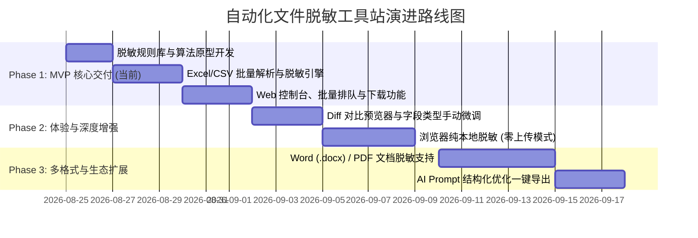

# 自动文件脱敏工具站（Excel 专项）全套产品与技术方案

> **文档状态**：`[权威/现行方案]`  
> **更新时间**：2026-08-24  
> **适用范围**：面向 AI 数据安全喂送场景的自动化文件脱敏工具站产品设计、规则引擎设计与系统技术架构。

---

## 目录
- [一、 方案背景与核心冲突剖析](#一-方案背景与核心冲突剖析)
- [二、 脱敏规则深度演进：从“简单掩码”到“AI 友好型脱敏”](#二-脱敏规则深度演进从简单掩码到ai-友好型脱敏)
  - [2.1 用户初始想法的优势与盲区诊断](#21-用户初始想法的优势与盲区诊断)
  - [2.2 核心设计哲学：安全合规 vs AI 可理解性平衡](#22-核心设计哲学安全合规-vs-ai-可理解性平衡)
  - [2.3 五层智能脱敏规则引擎体系](#23-五层智能脱敏规则引擎体系)
  - [2.4 三档开箱即用预设模式（Preset Profiles）](#24-三档开箱即用预设模式preset-profiles)
- [三、 产品功能与业务流程设计](#三-产品功能与业务流程设计)
  - [3.1 核心业务流程图](#31-核心业务流程图)
  - [3.2 关键功能模块分解](#32-关键功能模块分解)
  - [3.3 状态机与任务队列机制](#33-状态机与任务队列机制)
- [四、 UI/UX 界面设计规范与交互原型](#四-uiux-界面设计规范与交互原型)
  - [4.1 视觉风格与页面布局](#41-视觉风格与页面布局)
  - [4.2 核心界面线框图与交互细节](#42-核心界面线框图与交互细节)
- [五、 系统技术架构与可扩展设计](#五-系统技术架构与可扩展设计)
  - [5.1 整体技术架构图](#51-整体技术架构图)
  - [5.2 核心处理管道（Pipeline）与扩展接口](#52-核心处理管道pipeline与扩展接口)
  - [5.3 技术选型建议](#53-技术选型建议)
  - [5.4 零数据驻留与隐私安全防护机制](#54-零数据驻留与隐私安全防护机制)
- [六、 项目分期演进路线（Roadmap）](#六-项目分期演进路线roadmap)

---

## 一、 方案背景与核心冲突剖析

### 1.1 痛点背景
在大模型（LLM）日常应用中，用户经常需要上传 Excel 表格让 AI 进行**数据汇总、趋势分析、公式计算、代码生成、报表生成或归因诊断**。
然而，原始表格中通常混合包含以下高危敏感数据：
1. **个人身份隐私（PII）**：姓名、手机号、身份证号、银行卡号、邮箱、家庭地址等；
2. **商业敏感机密**：未公开财务数字、具体客户名称、供应商报价单、内部项目代码等。

若直接将原始 Excel 喂给公共大模型，存在严重的合规风险与商业泄密风险。

### 1.2 核心冲突：安全隔离 vs AI 上下文可理解性
| 维度 | 过度脱敏（Over-Masking） | 不足脱敏（Under-Masking） | **理想平衡（AI-Optimized Desensitization）** |
| :--- | :--- | :--- | :--- |
| **做法** | 所有文本全部打星 `***` 或删除整列 | 仅过滤部分词汇，数字/ID完全放行 | **保留 Schema、类型与枚举，敏感实体假名化映射** |
| **安全性** | 极高，但表格失去意义 | 低，高危数据泄漏 | **高，敏感真值被不可逆隔离** |
| **AI 可理解性** | 极低（AI 无法感知关联、无法归类分析） | 高（但存在安全合规红线） | **极高（AI 仍能精准计算、分类、多表关联、洞察趋势）** |

---

## 二、 脱敏规则深度演进：从“简单掩码”到“AI 友好型脱敏”

### 2.1 用户初始想法的优势与盲区诊断

用户提出的初始规则：
> 1. 数字不处理；
> 2. 文本列将中间一部分替换为 `*`，每个字符换一次（如 `NERQWEQ` $\rightarrow$ `NE***EQ`）。

#### 💡 优势：
- 逻辑直观，计算开销极低；
- 保留了字符串的首尾特征，人工浏览时能保留一定的辨识度。

#### ⚠️ 潜在盲区与风险：
1. **数字列其实包含大量最高危 PII**：
   - 手机号（11位纯数字）、身份证号（18位）、银行卡号（16-19位）在 Excel 中常以纯数字或文本型数字存储。**若“数字一律不处理”，这些高危个人隐私将 100% 泄露**。
2. **破坏表头（Header/Column Name）**：
   - 表头本身也是文本（如“客户姓名”、“季度营收”、“销售渠道”）。如果将表头也按文本打星（如“客**名”），**AI 将无法识别字段语义，导致大模型无法理解表格结构**。
3. **破坏类别枚举值（Categorical / Enum Values）**：
   - 诸如“北京市”、“未支付”、“VIP客户”等离散分类如果被打星，AI 无法进行分类统计（GROUP BY）与逻辑判断。
4. **实体关联性丢失（Entity Linkage Loss）**：
   - 若表格中多次出现客户“张三三”，如果简单打星为“张*三”，但另一个客户“张大三”也会变成“张*三”，导致 AI 进行按客户统计分析时产生严重的数据错乱（混淆实体）。

---

### 2.2 核心设计哲学：安全合规 vs AI 可理解性平衡

为了让脱敏后的表格不仅安全，还能**让 AI“看得懂、算得准、理得清”**，系统确立三条核心原则：
1. **结构完备（Schema Preservation）**：表头、单元格格式、公式关系、日期时间、列类型完整保留。
2. **实体一致性假名化（Consistent Pseudonymization）**：同一个实体（如同一客户名称）在全表中无论出现多少次，均映射为同一个代号（如 `CLIENT_01`），确保 AI 统计和关联分析结果完全正确。
3. **精准类型分级（Semantic-Aware Masking）**：识别列类型（是指标/金额、是标识ID、是枚举分类、还是长文本备注），采取不同的脱敏策略。

---

### 2.3 五层智能脱敏规则引擎体系

```
[原始 Excel 单元格数据]
         │
         ▼
┌────────────────────────────────────────────────────────┐
│ 第 1 层：结构与元数据防护 (Schema Guard)                 │
│  ├─ 识别第 1 行或冻结行为表头 (Headers) ──> 严格保留语义 │
│  └─ 识别公式 (=SUM...) / 日期 / 布尔值 ────> 保留结构   │
└────────────────────────┬───────────────────────────────┘
                         │
                         ▼
┌────────────────────────────────────────────────────────┐
│ 第 2 层：高危特征正则与算法识别 (High-Risk PII Detector)│
│  ├─ 手机号 (11位) ───────> 掩码/假名 (138****1234)      │
│  ├─ 身份证号 (18位) ─────> 掩码/哈希 (1101**********01)  │
│  ├─ 银行卡号 (16-19位) ──> 掩码 (6222***********1234)   │
│  ├─ 电子邮箱 (Email) ────> (u***r@domain.com)          │
│  └─ IP / MAC / 详细地址 ─> 脱敏/行政区截断              │
└────────────────────────┬───────────────────────────────┘
                         │
                         ▼
┌────────────────────────────────────────────────────────┐
│ 第 3 层：分类枚举与统计词汇识别 (Category Preserver)    │
│  ├─ 状态枚举 (如: "已完成","待审核") ─────> 保留原词    │
│  ├─ 行政区划级别 (如: "广东省-深圳市") ───> 保留至市级 │
│  └─ 低基数分类标签 (Distinct Count < 10) ─> 判定为分类  │
└────────────────────────┬───────────────────────────────┘
                         │
                         ▼
┌────────────────────────────────────────────────────────┐
│ 第 4 层：高基数文本实体一致性假名化 (Consistent Token)  │
│  ├─ 客户姓名/企业名称 ───> 映射为: 客户_001, 客户_002   │
│  ├─ 订单号/流水号 ───────> 映射为: ORD_A01, ORD_A02    │
│  └─ (保证同值同映射，跨行/跨Sheet关联不丢失)           │
└────────────────────────┬───────────────────────────────┘
                         │
                         ▼
┌────────────────────────────────────────────────────────┐
│ 第 5 层：长文本与常规文本掩码 (Text Middle Masking)    │
│  ├─ 用户指定的常规中间掩码 (如: NERQWEQ -> NE***EQ)    │
│  └─ 保留前后各 20%~25% 长度，中间字符以 * 替换         │
└────────────────────────────────────────────────────────┘
```

#### 详细脱敏处理对照表：

| 数据类别 | 识别方式 | 原始示例 | AI 友好模式（推荐） | 标准中间掩码模式 | 对 AI 影响分析 |
| :--- | :--- | :--- | :--- | :--- | :--- |
| **表头行 (Headers)** | 顶部索引/规则判定 | `客户姓名` / `销售金额` | `客户姓名` / `销售金额` (保留) | `客户姓名` / `销售金额` (保留) | AI 准确识别列定义与统计目的 |
| **手机号码** | 正则匹配 `1[3-9]\d{9}` | `13812345678` | `138****5678` | `138****5678` | 隐藏个人手机，保留运营商前缀 |
| **身份证号** | 正则 + 校验码规则 | `110101199003072345` | `110101********2345` | `110101********2345` | 保留省市区前缀与年龄段，隐藏真实ID |
| **银行卡号** | 正则匹配 Luhn 规则 | `6222021234567890123` | `622202*********0123` | `622202*********0123` | 保留卡类型，隔离真实账号 |
| **人名/负责人** | 命名实体/表头特征 | `梁小杰` / `周美玲` | `运营_01` / `开发_02`（全表一致映射） | `梁*杰` / `周*玲` | 假名化让 AI 正常计算每位负责人的绩效/ROI |
| **店铺/品牌/公司** | 字典/列名推断 | `IOO-US` / `Baidu` | `店铺_A01` / `品牌_B02` | `IO***-US` / `B****u` | 隔离真实品牌资产，保留业务分群对比能力 |
| **商品标识 (ASIN/MSKU/SKU)** | 规则/编码特征 | `B082ABC4P` / `IO02G-200` | `ASIN_001` (跨表映射一致) | `B082***C4P` / `IO**02G-200` | 保证跨表/跨文件 JOIN 关联查询不失真 |
| **商品标题/长描述** | 文本长度 > 30 | `200 Pack Gold Plastic Cups...` | 保留核心品类词（如 Plastic Cups）+ 品牌打星 | `IO*** 200 Pack Gold Plastic Cups...` | AI 可理解商品品类属性，抹去私有品牌 |
| **状态/分类/国家** | 列去重数 $\le 20$ | `美国` / `杯子` / `已支付` | `美国` / `杯子` / `已支付` (保留) | `美国` / `杯子` / `已支付` (保留) | 允许 AI 进行多维度分组聚合与下钻分析 |
| **常规长文本** | 自定义字符串 | `NERQWEQ` | `NE***EQ` (中间掩码) | `NE***EQ` (中间掩码) | 抹除具体标识符，保留结构形式 |
| **业务数值/金额/库存** | 数值类型（非ID/手机） | `12580.50` / `27` (库存件数) | `12580.50` / `27` (保留) | `12580.50` / `27` (保留) | AI 可进行求和、毛利率、库龄分析与周转率预测 |
| **日期/时间区间** | 日期类型 / 格式推断 | `2026-01~2026-01` | `2026-01~2026-01` (保留) | `2026-01~2026-01` (保留) | AI 可进行时间序列分析与同比环比计算 |

---

### 2.4 核心业务模块专属脱敏画像（结合电商/工厂/人事/仓储实战）

基于对实际业务（如亚马逊电商利润表、FBA多国库存表、组织架构映射表、生产工单与人事花名册）的深入分析，系统内置**行业专用字段识别与脱敏字典库**：

#### 🛒 模块 1：亚马逊电商与销售模块 (Amazon & E-Commerce Sales)
- **典型数据特征**：高维宽表（70+ 列），包含大量电商运营术语（ASIN、MSKU、FBA、Listing负责人、毛利率、广告费、关税、退款率等）。
- **实战脱敏策略**：
  - **核心标识（ASIN / 父ASIN / MSKU / SKU）**：采用**跨表一致性假名化**（如 `ASIN_001`）或**保留前缀后缀掩码**（如 `B082***C4P`）。在多文件批量脱敏时，同一批次的 `ASIN` 假名映射表在全局共享，确保用户将《利润报表》与《FBA库存表》一同喂给 AI 时，AI 仍能执行 `JOIN ON ASIN`！
  - **店铺/团队/公司**：`IOO***-US` $\rightarrow$ `店铺_01`；`Z*M` $\rightarrow$ `团队_A`。保留多店铺对比与组织架构汇总能力。
  - **Listing负责人/开发负责人**：真实人名转为 `运营_01`、`开发_01`，保障员工隐私。
  - **财务指标（毛利/ROI/采购成本/海运费/退款率）**：数值与百分比完整保留，AI 可做深度的财务归因与盈利模型分析。

#### 🏭 模块 2：工厂生产与供应链模块 (Manufacturing & Supply Chain)
- **典型数据特征**：BOM 配方表、生产工单号、批次号、原材料供应商、机器机台号、报废率、工时。
- **实战脱敏策略**：
  - **供应商名称/工厂代号**：`供应商_01`、`工厂_A`（隐藏真实供应链合作方，防止商业机密外泄）。
  - **BOM 配料核心参数**：敏感化学式/核心配比代码打星，常规物料类别（如“塑料粒子”、“包装盒”）保留。
  - **工单号/批次号**：前缀保留 + 序列假名化（如 `WO202608-****01`）。

#### 📦 模块 3：仓储与 FBA 库存流转模块 (Warehouse & FBA Logistics)
- **典型数据特征**：多国海外仓（美/英/德/法/意/西）、AWD在途、库龄区间（30天/60天/365天以上）、残损件数。
- **实战脱敏策略**：
  - **仓库实体名称**：保留国家属性（如“美国仓-01”、“德国仓-02”），模糊第三方私有海外仓真实名。
  - **库龄与库存数量**：数值完全保留，保证 AI 可以计算“滞销冗余库存成本”和“缺货补货预测”。

#### 👥 模块 4：人事与行政薪酬模块 (HR & Administration)
- **典型数据特征**：员工花名册、身份证号、银行卡号、手机号、部门、职级、基本工资、绩效奖金、社保公积金。
- **实战脱敏策略**：
  - **姓名/身份证/手机号/银行卡**：全量掩码或假名化为 `员工_1001`（高危个人 PII 严防死守）。
  - **部门/职级/岗位**：保留（如“跨境运营部-资深主管”），以便 AI 分析人效与组织薪酬分布。
  - **薪资数值（可选）**：支持“原值保留”或“薪酬区间化/添加微扰”以平衡人效分析与薪酬保密。

---

### 2.5 三档开箱即用预设模式（通俗大白话版）

在产品界面上提供三档一键切换预设，普通业务人员看一眼就能直接选对：

1. 🌟 **模式 1：智能 AI 模式（喂给 AI 分析专用 — 强烈推荐）**
   - **一句话通俗理解**：**“用代号换隐私，不耽误 AI 算账”**。
   - **具体怎么脱敏**：
     - 把表格里的**真实人名自动替换为“运营_01”、店铺名替换为“店铺_A”、商品编码替换为“ASIN_001”**；
     - 重点：**多张表格里的同一个人或同一种商品，换出来的代号前后完全一致**（比如《利润表》和《FBA库存表》里的同一个 ASIN 都会变成 `ASIN_001`）；
     - **销量、销售额、采购成本、毛利率、日期等数字 100% 完整保留**；
     - 手机号、身份证号、银行卡号自动隐藏。
   - **适用场景**：直接把表格丢给 ChatGPT / Claude / DeepSeek / 通义千问等，让 AI 帮您**算毛利、查滞销品、做多表合并分析、写汇报总结**，算得又快又准，还不泄露商业机密。

2. 🛡️ **模式 2：经典打星模式（对外发文件专用）**
   - **一句话通俗理解**：**“文字中间打星号，保留头尾看得懂”**。
   - **具体怎么脱敏**：
     - 文字和编码中间部分**全部变成“*”号**（例如文字 `NERQWEQ` 会变成 `NE***EQ`，手机号 `13812345678` 变成 `138****5678`）；
     - 表头名字不打星，表格里的数字正常保留。
   - **适用场景**：文件需要发送给外部合作工厂、服务商、供应商或跨部门传阅，既能挡住敏感信息，肉眼浏览时还能看出原来的编码格式。

3. 🔒 **模式 3：绝密粉碎模式（极端保密专用）**
   - **一句话通俗理解**：**“所有文字全变乱码，彻底抹掉原始信息”**。
   - **具体怎么脱敏**：
     - 除了第一行表头保留外，所有文字内容全部粉碎成**随机乱码代号**（如 `ANON_8392`），完全看不出任何原始内容的字样。
   - **适用场景**：涉及核心商业机密、绝密财务审计或研发测试，要求“任何人都无法通过文字猜出原来是什么”。

---

## 三、 产品功能与业务流程设计

### 3.1 核心业务流程图

```mermaid
flowchart TD
    A[用户访问工具站] --> B[选择脱敏模式 / 配置规则]
    B --> C[批量拖拽上传 Excel 文件 (.xlsx/.xls/.csv)]
    C --> D[前端校验文件格式与大小]
    D --> E[文件加入【处理队列】]
    
    subgraph 队列与处理管道 [Worker Task Queue]
        E --> F[按顺序取出任务: 状态变为'处理中']
        F --> G[解析 Excel (Sheets / Cells / Formats)]
        G --> H[列语义推断 + 敏感数据识别]
        H --> I[执行脱敏与假名化转换]
        I --> J[重新生成安全 Excel 文件]
        J --> K[生成脱敏报告与 Diff 预览数据]
    end

    K --> L[状态变为'已完成'，并在界面实时刷新]
    L --> M{用户操作}
    M -->|点击单项| N[预览脱敏前后对比 (Diff View)]
    M -->|单个下载| O[下载指定脱敏后文件]
    M -->|一键打包| P[下载全部已完成 ZIP 压缩包]
    M -->|阅后即焚| Q[关闭页面或 30 分钟后自动物理销毁文件]
```

### 3.2 关键功能模块分解

1. **批量上传与拖拽区 (Batch Dropzone)**：
   - 支持多文件同时拖入或点击选择；
   - 支持 `.xlsx`, `.xls`, `.csv`；
   - 前端限制单文件上限（如 50MB）与批量上限（如单次最多 20 个文件）；
   - 文件即传即显，展示文件名、大小、初始排队状态。

2. **排队与实时进度看板 (Queue & Progress Monitor)**：
   - 支持多任务排队机制（FIFO 先入先出）；
   - 任务状态：`排队中 (Pending)` $\rightarrow$ `解析中 (Parsing)` $\rightarrow$ `脱敏中 (Processing)` $\rightarrow$ `已完成 (Completed)` / `失败 (Failed)`；
   - 动态进度条与处理耗时展示；
   - 支持单任务取消与一键清空列表。

3. **脱敏前后 Diff 对比预览器 (Diff Preview Modal)**：
   - 用户无需先下载文件，在页面点击“预览对比”即可弹出弹窗；
   - 展示脱敏前 VS 脱敏后的前 20 行样本数据；
   - 高亮标出被脱敏处理的单元格（如绿色高亮表示保留，黄色高亮表示打星/假名化）。

4. **安全下载与生命周期管理 (Secure Download & Auto-Purge)**：
   - 单文件独立下载按钮（自动重命名为 `原文件名_desensitized.xlsx`）；
   - “一键下载全部”功能（后端打包为 `desensitized_files_时间戳.zip`）；
   - **阅后即焚与隐私保障**：内存流处理优先；若落地临时文件，后端启动定周期 Timer（如 30 分钟无操作自动物理删除，或用户点击“清空”即时彻底擦除）。

---

## 四、 UI/UX 界面设计规范与交互原型

### 4.1 视觉风格与页面布局
- **设计风格**：现代 SaaS 控制台极简风格（类 Linear / Vercel / GitHub 风格），以冷白/浅灰为底色，深灰字体，搭配品牌蓝（`#2563EB`）与安全绿（`#10B981`），呈现专业、可信、高效的工具质感。
- **布局划分**：
  - **顶部导航栏 (Header)**：产品 Logo、产品 Slogan（“面向大模型的智能文件脱敏工作站”）、安全声明与隐私保证徽章。
  - **左侧/顶部规则控制台 (Config Panel)**：脱敏模式三档切换卡片（AI友好/标准掩码/深度匿名）、高级自定义选项折叠面板。
  - **主体核心操作区 (Main Area)**：
    - 上部：大面积拖拽上传框（Dropzone）；
    - 下部：实时任务队列与文件下载表格（Data Table）。

### 4.2 核心界面线框图与交互细节

```
+-----------------------------------------------------------------------------------------+
| [🛡️ AI-Mask] 智能文件脱敏站    (本地/零驻留安全保护中 🟢)                   [GitHub] [帮助] |
+-----------------------------------------------------------------------------------------+
| ⚙️ 选择脱敏策略:                                                                         |
| (•) 🌟 AI 数据分析友好模式 [推荐]    ( ) 🛡️ 标准字符掩码模式     ( ) 🔒 深度完全匿名化模式   |
|     保留表头与分类枚举，客户名/ID假名化，数值正常保留               所有文本中间打星，手机身份证掩码  |
+-----------------------------------------------------------------------------------------+
|                                                                                         |
|      ┌ - - - - - - - - - - - - - - - - - - - - - - - - - - - - - - - - - - - - - ┐      |
|      |                        📂 点击或将 Excel 文件拖拽到此处                      |      |
|      |              支持 .xlsx, .xls, .csv | 支持多文件批量排队处理 (最大 50MB)      |      |
|      └ - - - - - - - - - - - - - - - - - - - - - - - - - - - - - - - - - - - - - ┘      |
|                                                                                         |
+-----------------------------------------------------------------------------------------+
| 📋 文件处理队列 (共 3 个文件 | 2 已完成 | 1 处理中)               [🔄 全部重试] [⬇️ 打包下载全部] |
+-----------------------------------------------------------------------------------------+
| 文件名                大小      状态        脱敏字段数   进度       操作                   |
+-----------------------------------------------------------------------------------------+
| 2026Q1销售业绩明细.xlsx 2.4MB    ✅ 已完成    420 处      100%       [👁️ 效果对比] [⬇️ 下载] |
| 客户联系人清单.xlsx    850KB    ⚡ 脱敏中    115 处      [======> ] [ 取消 ]                |
| 供应商采购报价单.xlsx  1.2MB    ⏳ 排队中    --          0%         [ 移出队列 ]            |
+-----------------------------------------------------------------------------------------+
```

---

## 五、 系统技术架构与可扩展设计

### 5.1 整体技术架构图

```mermaid
graph TD
    subgraph Frontend [前端 Presentation Layer]
        A1[Vue 3 / React SPA]
        A2[Uppy / FilePond 批量上传组件]
        A3[SheetJS / Canvas-Datagrid 前端预览]
        A4[Web Worker 本地脱敏模式 (可选零上传)]
    end

    subgraph API_Gateway [网关与任务调度]
        B1[FastAPI / Node.js 服务端]
        B2[Task Queue 任务队列 (Async Queue)]
    end

    subgraph Core_Engine [核心脱敏引擎 Pipeline]
        C1[文件解析器 Parser: Excel / CSV]
        C2[列元数据与语义分类器 Schema Analyzer]
        C3[规则调度中心 Rule Dispatcher]
        C4[实体假名化与掩码转换器 Cell Masker]
        C5[序列化重构器 Serializer]
    end

    subgraph Storage_Security [临时存储与安全层]
        D1[内存流处理 (Memory Stream)]
        D2[临时沙箱 (Tmpfs / 阅后即焚)]
        D3[Auto-Purge 自动销毁守护协程]
    end

    Frontend --> API_Gateway
    API_Gateway --> Core_Engine
    Core_Engine --> Storage_Security
```

### 5.2 核心处理管道（Pipeline）与可扩展接口设计

为支持未来扩展到 **Word (.docx)、PDF (.pdf)、JSON、TXT、CSV** 等格式，核心引擎采用**解耦的插件化抽象架构**：

```python
# 核心抽象接口示例 (Python/FastAPI 或 Node.js 架构通用)
from abc import ABC, abstractmethod
from typing import BinaryIO, Dict, Any

class IFileProcessor(ABC):
    """通用文件脱敏处理器基类，支持未来各种文件类型的水平扩展"""
    
    @abstractmethod
    def validate(self, file_stream: BinaryIO) -> bool:
        """格式与完整性校验"""
        pass

    @abstractmethod
    def parse_to_intermediate(self, file_stream: BinaryIO) -> Any:
        """解析为统一的中间数据结构（表格矩阵 / 文档 AST）"""
        pass

    @abstractmethod
    def apply_rules(self, data: Any, config: Dict[str, Any]) -> Any:
        """执行脱敏转换逻辑"""
        pass

    @abstractmethod
    def export(self, desensitized_data: Any) -> BinaryIO:
        """重新组装并导出为脱敏文件流"""
        pass
```

- **当前实现**：`ExcelFileProcessor`（基于 `openpyxl` / `calamine` 高性能库处理 `.xlsx/.xls`）与 `CsvFileProcessor`。
- **未来扩展**：直接新增 `DocxFileProcessor`、`PdfFileProcessor`、`JsonFileProcessor`，注册进处理工厂即可，前端与任务队列层无需做任何破坏性改动。

### 5.3 关键算法实现逻辑（文本中间打星与智能假名化）

#### 1. 中间打星算法（遵循用户指定规则：每个字符换一次 `*`）：
```python
def mask_text_middle(text: str, keep_ratio: float = 0.25) -> str:
    """
    文本中间替换为 '*'，每个字符换一次
    例如: 'NERQWEQ' (长7) -> 'NE***EQ'
    """
    if not text or len(text) <= 2:
        return text  # 极短字符不打星或仅打尾部
    
    length = len(text)
    # 计算两侧保留的字符数，最小保留 1 个字符
    keep_len = max(1, int(length * keep_ratio))
    
    # 若中间已无空间打星，则保留首尾各 1 个字符
    if keep_len * 2 >= length:
        keep_len = 1
    
    mask_len = length - (keep_len * 2)
    return text[:keep_len] + ("*" * mask_len) + text[-keep_len:]
```

#### 2. 实体一致性假名化映射器（保证跨行关联不丢失）：
```python
class PseudonymMapper:
    """全表/多表一致性假名映射器"""
    def __init__(self):
        self.mapping_dict = {}
        self.counters = {}

    def get_pseudonym(self, raw_value: str, entity_type: str = "实体") -> str:
        if raw_value not in self.mapping_dict:
            current_idx = self.counters.get(entity_type, 1)
            self.counters[entity_type] = current_idx + 1
            self.mapping_dict[raw_value] = f"{entity_type}_{current_idx:02d}"
        return self.mapping_dict[raw_value]
```

### 5.4 零数据驻留与隐私安全防护机制

为了彻底消除用户的安全顾虑，系统应具备两套部署/运行模式：

1. **浏览器纯前端/客户端模式（Client-Only Mode - 极致安全）**：
   - 使用 WebAssembly 或纯 JS（如 SheetJS）在浏览器内存中完成解析与脱敏，**文件根本不上云、不离开用户电脑**，网络请求抓包为 0。
2. **服务端高性能模式（Server-Assisted Mode - 适合大文件/复杂算法）**：
   - **内存流式处理**：文件在内存中完成“接收 $\rightarrow$ 脱敏 $\rightarrow$ 输出”，不写入物理硬盘。
   - **临时目录沙箱与定时清理**：如果必须写入磁盘临时缓存，生成随机 UUID 隔离目录，处理完成即刻销毁，且后台异步定时器每 10 分钟强行清理存留超过 30 分钟的临时文件。

---

## 六、 项目分期演进路线（Roadmap）



### 阶段目标：
- **Phase 1（当前重点）**：聚焦 Excel（.xlsx/.xls/.csv），实现三档预设脱敏模式、批量上传、顺序队列排队处理、脱敏文件生成与单个/打包下载。
- **Phase 2**：加入“脱敏前后 Diff 实时可视化预览”及“浏览器纯前端零上传运行支持”。
- **Phase 3**：水平拓展至 Word、PDF、JSON 等多种文件格式，并提供“一键生成适合直接粘贴给 AI 的 Markdown 提示词”。


笔记、勿删：
### 针对您六大业务模块的实战脱敏策略与优化重点

#### 1. 跨表多维关联一致性保护（核心关键点）
在亚马逊电商与供应链分析中，常常需要把《利润报表》与《FBA库存表》按 `ASIN`/`MSKU` 关联，再通过《店铺团队映射表》按 `店铺` 汇总到 `团队`/`公司`：
- **如果各自孤立打星**：会导致 `B082***C4P` 与 `B082***XX1` 产生碰撞或映射断裂，AI 无法进行多表 `JOIN`。
- **方案优化（跨表共享假名化池）**：多文件批量上传时，系统自动维持同一批次的**全局映射池**（例如同真实的 `ASIN` 统一映射为 `ASIN_001`，同真实的 `店铺` 统一映射为 `店铺_A01`）。这样脱敏后的多份文件同时喂给 AI 时，**AI 依然能进行跨表精准关联计算与多维归因**。

---

#### 2. 各模块专用脱敏画像沉淀

| 业务模块 | 典型数据列 | 识别与脱敏处理策略 | 对 AI 分析的价值保障 |
| :--- | :--- | :--- | :--- |
| **🛒 亚马逊销售与利润** | `ASIN`, `MSKU`, `Listing负责人`, `店铺`, `毛利率`, `广告费`, `ROI` | • 负责人真实姓名 $\rightarrow$ `运营_01`<br>• 店铺/品牌 $\rightarrow$ `店铺_01` 或前缀掩码<br>• 利润率/广告费/销量 $\rightarrow$ **100% 原值保留** | AI 仍能精准输出各负责人绩效、店铺盈利排行与投入产出比预测 |
| **📦 仓储与 FBA 库存** | `多国库存`, `AWD在途`, `30-365天库龄`, `残损件数`, `单位采购成本` | • 仓库名称 $\rightarrow$ 保留国家标识（如 `美国仓_01`）<br>• 库龄/件数/在途量 $\rightarrow$ **100% 原值保留** | AI 能精准预测冗余滞销风险、计算库龄成本并生成补货建议 |
| **🏭 工厂生产与供应链** | `BOM配方`, `工单批次号`, `原料供应商`, `报废率`, `工时` | • 供应商名称 $\rightarrow$ `供应商_01`<br>• 核心配方代码 $\rightarrow$ 字符中间打星<br>• 批次号/报废率 $\rightarrow$ 格式保留 | 严防供应链与核心配方泄密，同时支持 AI 诊断生产良品率 |
| **👥 人事、行政与薪酬** | `员工姓名`, `身份证`, `手机号`, `银行卡`, `部门`, `基本工资`, `绩效` | • 四大高危 PII $\rightarrow$ **严格掩码/哈希隔离**<br>• 部门/岗位 $\rightarrow$ **完整保留**<br>• 薪资 $\rightarrow$ 可选原值或区间化扰动 | 杜绝个人隐私与薪酬泄密，同时支持 AI 进行人效与岗位结构分析 |
